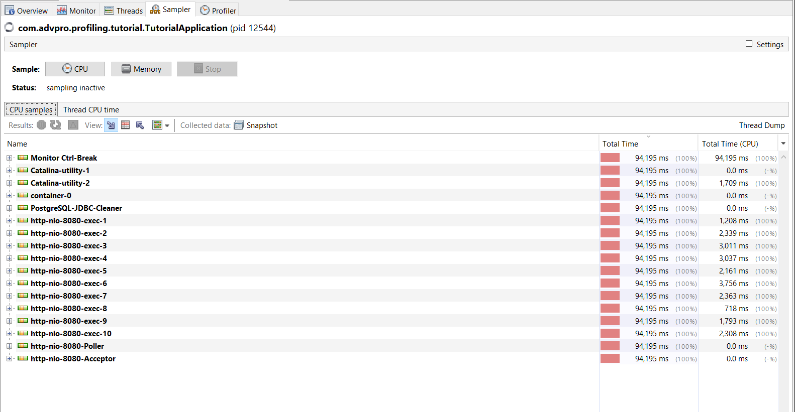
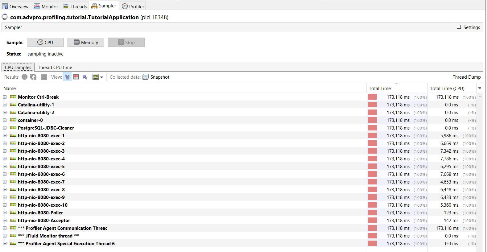
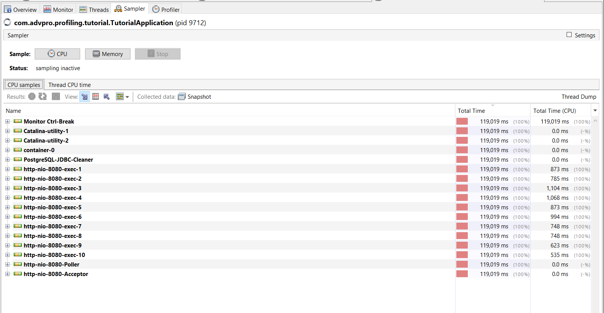
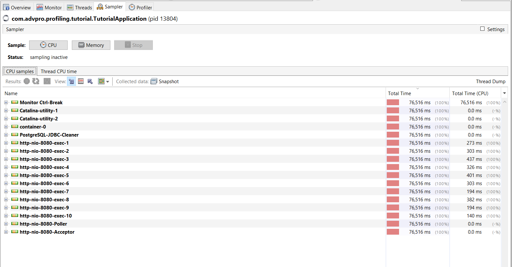

### JMeter Performance Testing Results
1. Endpoint `/all-student`

2. Endpoint `/all-student-name`

3. Endpoint `/highest-gpa`

### JMeter CLI Execution

### Profiling & Optimization Analysis

1. Endpoint `/all-student` (Before Optimization)

2. Endpoint `/all-student-name` (Before Optimization)

3. Endpoint `/highest-gpa` (Before Optimization)

### Kesimpulan Optimasi (After Optimization)

Setelah melakukan profiling dan menemukan bottleneck, dilakukan refactoring pada ketiga metode di `StudentService`. Hasilnya, performa aplikasi meningkat secara drastis dengan rincian perbaikan sebagai berikut:

1. Endpoint `/all-student` (N+1 Query Problem):
   Mengganti *looping query* dengan satu pemanggilan `studentCourseRepository.findAll()`. Hal ini menghilangkan ribuan query berlebih ke database.

2. Endpoint `/all-student-name` (Memory Overhead):
   Mengganti operasi String concatenation dengan Java Stream API dan `Collectors.joining()`. Hal ini mencegah pembuatan puluhan ribu objek String baru di memori yang membebani Garbage Collector.

3. Endpoint `/highest-gpa` (Inefficient Data Fetching):
   Mendelegasikan proses pencarian nilai tertinggi langsung ke database menggunakan custom query `findFirstByOrderByGpaDesc()`. Hal ini mencegah penarikan seluruh data mahasiswa (puluhan ribu baris) ke dalam memori aplikasi (RAM).

Bukti Profiling Sesudah Optimasi:
